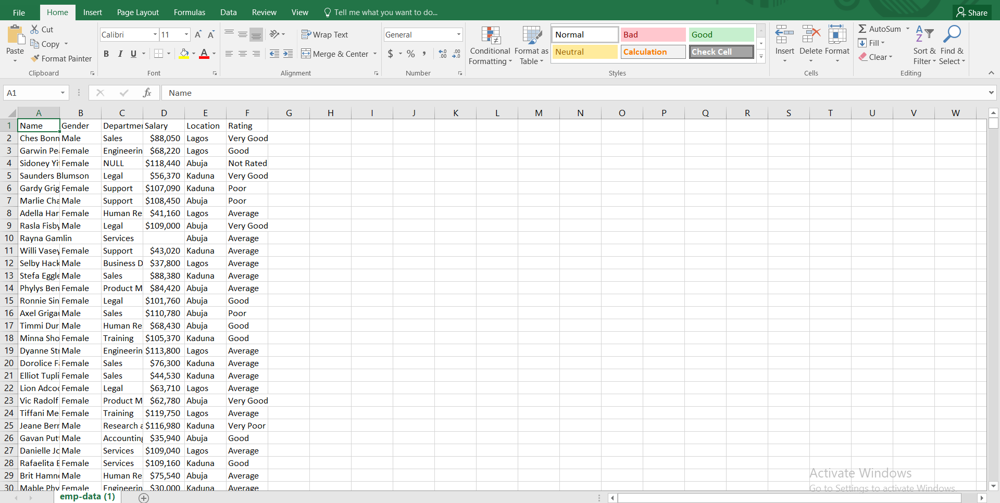
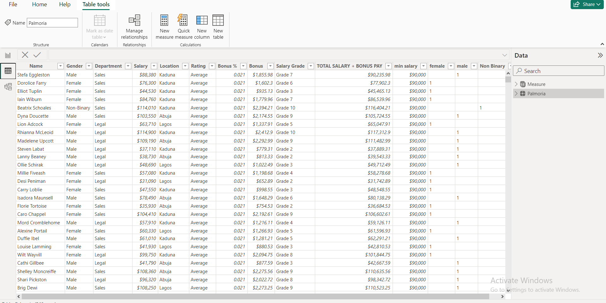

# Palmoria-HR-analysis

Image by <a href="https://www.freepik.com/free-photo/flat-lay-people-working-desk_32987895.htm#query=HR%20ANALYTICS&position=42&from_view=search&track=ais&uuid=d2997575-9d13-4554-bb83-749d467a2c54">Freepik</a>
##  Introduction
This is a power Bi project on HR analysis of **The Palmoria Group**, a manufacturing company based in the Nigeria
embroiled in issues bordering on gender inequality in its 3 regions.
Mr Gamma , a director decided to recruit me as a HR Analytics expert to
analyse the company’s HR data and come up with recommendations for management’s attention.

**_Disclaimer_** _All datasets and reports do not represent any company or institution but just a dummy dataset
to demonstrate capabilities in PowerBi_.
## Problem Statement 
1. What is the gender distribution in the organization? Distil to
regions and departments
2. What are insights on ratings based on gender?
3. Is there a gender pay gap in the company's salary structure?
4. A recent regulation was adopted which requires
manufacturing companies to pay employees a minimum of
$90,000. Does Palmoria meet this requirement?
5. What is the amount to be paid as bonus to individual
employees?
6. what is the total amount to be paid to individual employees
(salary inclusive of bonus)?
7. what is the total amount to be paid out per region and company-wide?

   ##  Skills/Concept Demonstrated
   The following PowerBi features were incorporated:
   - Quick measures
   - Filters
   - Power Query
   - DAX

   ## Modelling
   The project did not require modelling of any sort as it was only a single table of data.

   ## Data Sourcing
   The data was downloaded as a csv file. it is an employee table that 1016 rows and 6 columns of data. 

   ## Data Cleaning/Manipulation
   The data was effciently cleaned using basic excel functions to replace missing values
   
   It was then transformed using Power Query in PowerBi. Some of the applied steps included
   - creating new columns for bonus and salary grade.
   - making first rows as headers in the employee table
   - creating new measures to calculate total number of male and female staffs `FEMALE STAFF = calculate(COUNTROWS(Palmoria), Palmoria[Gender]="female")`
     `MALE STAFF = calculate(COUNTROWS(Palmoria), Palmoria[Gender]="male")`
   -  calculating bonus pay per individual employee which is 2.1% of their salary `[Bonus ] = 
Palmoria[Salary]*Palmoria[Bonus %]`
     
   
   ## Data Analysis and Visualization
   - The Organisation has a total of 946 staffs with 465 males (49.1%) and 441 females (46.6%) across all regions.
   - There is no gender pay gap in the companies salary structure as both male and female employees are evenly compensated from the data.
   - Palmoria does not meet the regulatory requirement thats states that manufacturing companies must pay a minimum of $90,000 annually to their staffs.
     The lowest paid staff at Palmoria gets $28,000 anually.
   - The amount being paid as bonus to individual employees is $2.2M
   - The total amount being paid out total amount to be paid to individual employees (salary inclusive of bonus) is $71.92M.
                                         
    
 

